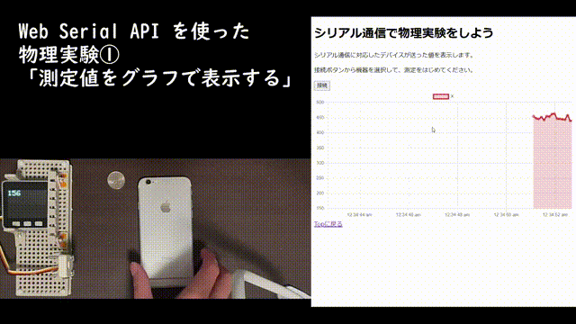
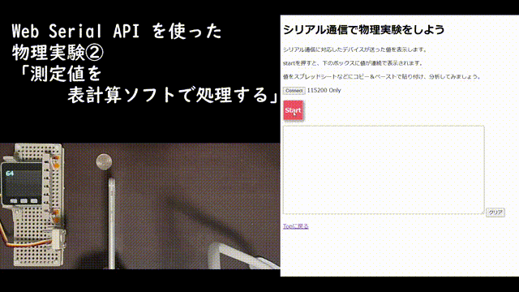

# シリアル通信で物理実験をしよう

* Web Serial APIを使って、マイコン等とシリアル通信をします。
* 数値のみが送られてくることを想定しています。

### [実験①：測定値のグラフを表示する](https://phys-ken.github.io/webserial_app/graphapp.html)

* シリアル通信デバイスと接続し、「接続」ボタンからデバイスを選択します。
* 接続すると、勝手に測定が始まり、グラフも描画されます。

### [実験②：測定値を取得して、定量的に分析する](https://phys-ken.github.io/webserial_app/valueapp.html)

* シリアル通信デバイスと接続し、「接続」ボタンからデバイスを選択します。
* start を押すと、測定結果が表示されます。
* stop を押すと、測定が中断します。
* クリアを押すと、内容がリセットされます。
* コピー＆ペーストで、測定値をスプレッドシート等に書き出すことも可能です。

## 参考にしたサイト
* [Web Serial API＋ESP32(Arduino)研究 その1 シリアルコンソール](https://lang-ship.com/blog/work/web-serial-api-esp32-01-console/)
* [Web Serial API を使って micro:bit からセンサーの値（XYZ）を読み取る＆リアルタイムなグラフ化](https://qiita.com/youtoy/items/6394a5570ddd54a2ce87)

## リンク
* [シリアル通信で物理実験をしよう Topにもどる](https://phys-ken.github.io/webserial_app
)
* [Phys-kenのTopにもどる](https://phys-ken.github.io/phys-ken/)
* [@Phys-ken(Twitter)](https://twitter.com/phys_ken)
* [2022授業資料案](https://phys-ken.github.io/webserial_app/2022_jugyos/error.html)